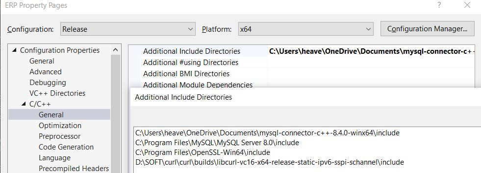

# ERP
## Description
This ERP project uses C++ , MySQL and Openssl. Openssl to safely store our password in the database and MySQL for our backend database. 
OpenSSL is used to provide extra security for password we have used sha256 hashing to secure data and salt too. 
The password is salted then hashed then they are stored in separate table in database with username.

The project has 3 types of users admin, staff and student. Each User has different level of authority and functions they can implement. 
- Admin can do everything from adding fees, semester change, marks update, Attendance Update, Salary Change/Add, Add User and Delete User etc.
- Staff have most function based on student specially students that they teach If a teacher teaches tcs101 to semester 1 sec a then he cannot take attendance of tcs102 or add marks.
  You can only change/Add changes to your own teaching section of that subject.
- Student on other hand has least authority they can only view data like view attendance, view marks, view own data, view teaching faculty data etc.
## Motive
- I wanted to create a OOPS project with a backend for database so I created this then little by little I added more functionalities as I went Adding OpenSSL in last.

## Software Version
- Visual Studio Version: Microsoft Visual Studio Community 2019 Version 16.11.31
- MySQL version : mysql  Ver 8.0.37 for Win64 on x86_64 (MySQL Community Server - GPL)
- OpenSSL version : OpenSSL 3.3.1 4 Jun 2024 (Library: OpenSSL 3.3.1 4 Jun 2024)
- In future some files could be different as of now but the way to install and give path will probably be same. This project is made in 14-06-2024
## Installation
> [!IMPORTANT]
> While giving the paths for the directory in Visual Studion make sure that you are in x64 platform and Release Configuration. I also have provided the screenshots check them out for better understanding
### Installing Dependencies
#### MySQL
  -	While installing MySQL installer please do remember the password save it somewhere.
  -	Before running the code First make sure to include all the tables you can do so by going to the MySQL command Line Client which you can found from searching in start, Enter the password then create a database e.g. CREATE DATABASE erp;
  -	Then use erp(database_name); to enter database and add tables.
  -	Whatever name you give it you will need to change the database.cpp file also change your password in  (!mysql_real_connect(conn, "localhost", "root", "your_password", "database_name", 3306, NULL, 0))
  -	Other than these two most of them will be same.
  -	For Setup of MySQL follow this YouTube video I also followed this person’s instructions and it worked perfectly.
  -	YouTube Link : https://youtu.be/yNniOHn9Xe0?si=gV1jeJSCyXxOEHFd
  -	In tables_sql.txt I already have code for all table data.
  -	In table_sql_fill.txt I have included all the insert query for course and fees data.
  -	And I also, have excel files for both the tables too for better view. You can add your own custom course data if you like this is just sample data I created.
> [!IMPORTANT]
> You must Create an admin (first user) for entering the erp login from the mysql command client itself. After that admin can be added from erp itself.

#### OpenSSL
  - Download the OpenSSL library setup file from Here - https://slproweb.com/products/Win32OpenSSL.html
  - Download the latest full version not light: e.g., Win64 OpenSSL v3.3.1 (Exe File)
  - After Installation include the opensssl path:
  - Go the PC then right click and Properties then Advanced System Setting in there Advanced and click environment variables:In the window in system variable go to path-edit-new-paste the openssl path should be like this: C:\Program Files\OpenSSL-Win64\bin (check your window to verify if different change it)
  - Make sure the following settings are setup in the project property pages:
  - Go To Project: [project name] Properties
    - [C/C++ -> General -> Additional Include Directories] value: OpenSSL’s include directory in your machine (e.g. C:\Program Files\OpenSSL-Win64\include)
    - [Linker -> General -> Additional Library Directories] value: OpenSSL’s lib directory in your machine (e.g. C:\Program Files\OpenSSL-Win64\lib)
    - [Linker -> Input -> Additional Dependencies] value: C:\Program Files\OpenSSL-Win64\lib\VC\x64\MT\libssl.lib
    - [Linker -> Input -> Additional Dependencies] value: C:\Program Files\OpenSSL-Win64\lib\VC\x64\MT\libcrypto.lib
	- Path could be different so use what’s yours
### Project File/Configuration ScreenShots
Project Files             |  In Project Preview
:-------------------------:|:-------------------------:
  |  
Project Properties             |  C++ General Paths
  |  
Linker General Paths            |  Linker Input Paths
  |  

## Running
- First Create an empty Project in Visual Studio with name you want.
- Add all the files in this repository the .cpp and .h files in the source and  make sure to add the file. Right click on project on right side you can add file then copy paste or just add existing file. Don’t forget to change the database name and password. I already told above.
- Make sure you are running this on x64 and release Configuration.

#### You can play around with the functionalities in the ERP and understand it or add your own functionalities too.
ERP Login Screen             |  ERP Admin Menu
:-------------------------:|:-------------------------:
  |  
ERP Staff Screen             |  ERP Student Menu
  |  
## Good Luck [-_-]

